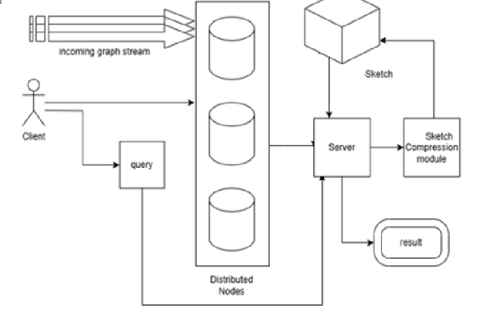

# Distributed Graph Stream Processing using Adaptive Hash Sketch on Apache Spark

<h4>Check Out the Explanation and Demonstration Here for a Better Understanding ⬇️ </h4> <pre><a href="https://youtu.be/oTdzWLTgmnw" target="_blank"><code>https://youtu.be/oTdzWLTgmnw</code></a></pre>

A scalable, memory-efficient system for <b>real-time processing and querying of massive graph streams</b>. 
This project introduces a novel adaptive hash-based approach
to distributed graph stream processing using <b>Apache Spark</b>, enabling low-latency analytics over high-throughput streaming graph data.

<h2>Mathematical Foundations & Overview</h2>

Our system processes a dynamic graph stream <code>S = {e₁, e₂, ..., eₜ}</code>, where each edge <code>e = (s, d, t, w)</code> represents a connection from node <code>s</code> to node <code>d</code> at time <code>t</code> with weight <code>w &gt; 0</code>.

<ul>
  <li>Unlike static methods, this system supports <b>real-time updates and queries</b> on continuously evolving graphs.</li>
  <li>We introduce a self-designed <b>adaptive hash sketch</b> that dynamically expands its hash space to handle collisions while maintaining query accuracy.</li>
</ul>

  

<h3>1. Adaptive Hash Function Strategy</h3>

Each node is hashed using multiple hash functions to generate hash patterns:

<pre><code>H_k(s) = MD5(s + k) mod W</code></pre>
<pre><code>H_k(d) = MD5(d + k) mod W</code></pre>

Where <code>k</code> ranges from <code>0</code> to <code>current_hash_count - 1</code>, and <code>W</code> is the sketch width.

<h3>2. Dynamic Hash Space Expansion</h3>

The system monitors collision rates and automatically expands the hash space when needed:

<pre><code>collision_rate = full_cells / total_cells</code></pre>
<pre><code>if collision_rate > 0.8: current_hash_count += depth</code></pre>

When expansion occurs, existing data is redistributed across the new hash space to maintain accuracy.

<h3>3. Sketch Insertion Logic</h3>

We maintain a dynamic hash structure <code>Sketch[k][i][j]</code> where:

<ul>
  <li><code>k</code> is the hash function index (expandable)</li>
  <li><code>i, j</code> are hash coordinates from <code>H_k(s)</code> and <code>H_k(d)</code></li>
</ul>

For each edge insertion:

<ul>
  <li>Try to place the edge in the first available cell across all hash functions</li>
  <li>If the edge already exists → accumulate weight</li>
  <li>If all cells are full and collision rate is high → expand hash functions</li>
  <li>Redistribute existing data after expansion</li>
</ul>

<h3>4. Edge Weight Query</h3>

To estimate the weight of an edge <code>(s, d)</code>:

<ol>
  <li>Compute hash patterns for both nodes across all hash functions</li>
  <li>Search for the edge in corresponding cells</li>
  <li>Sum the proportional weights from all matching cells</li>
</ol>

<h3>5. Reachability Query</h3>

Given nodes <code>A</code> and <code>C</code>, we scan all hash tables to find if the edge <code>A → C</code> exists in any cell. The adaptive hash structure ensures comprehensive coverage with minimal false negatives.

<h3>Applications</h3>
<ul>
  <li>Social networks: connection strength estimation, relationship tracking</li>
  <li>Network monitoring: traffic flow analysis and congestion detection</li>
  <li>Financial systems: transaction pattern analysis and fraud detection</li>
  <li>Web analytics: user journey mapping and clickstream analysis</li>
</ul>

<h2>Key Features</h2>
<ul>
  <li><b>Adaptive Hash Expansion</b> with dynamic collision detection and automatic hash space scaling for optimal memory utilization</li>
  <li><b>Apache Spark Integration</b> using structured streaming and batch-wise transformations for scalable distributed edge processing</li>
  <li><b>Client-Server Query Engine</b> designed to support real-time estimation of edge weights and direct reachability queries</li>
  <li><b>Self-Optimizing Structure</b> ensuring efficient ingestion and processing of continuously evolving graph data</li>
</ul>

<h2>Architecture</h2>

The system is composed of three modular components:

<ol>
  <li><b>Adaptive Sketching Module:</b> Maintains a dynamically expanding in-memory hash structure with intelligent collision handling</li>
  <li><b>Distributed Spark Backend:</b> Processes edge updates in batches across cluster nodes using Spark DataFrame APIs and streaming aggregators</li>
  <li><b>Client-Server Interface:</b> Handles external query requests, provides real-time statistics, and supports concurrent sessions</li>
</ol>

<h2>Tech Stack</h2>
<ul>
  <li><b>Apache Spark</b> – Stream processing and distributed data transformations</li>
  <li><b>Python</b> – Core implementation of the adaptive sketching logic and server infrastructure</li>
  <li><b>Socket Programming</b> – TCP-based client-server communication for real-time interaction</li>
  <li><b>Structured Streaming</b> – Incremental data ingestion with adaptive batch processing</li>
</ul>

<h2>Getting Started</h2>
<ol>
  <li>Clone the repository: 
    <pre><code>git clone https://github.com/harutoNaiz/Distributed-Graph-Stream-Processing-using-Adaptive-Hash-Sketch-on-Apache-Spark.git</code></pre>
  </li>
  <li>Install Spark</li>
  <li>Navigate to the server's dir and run : </li>
  <pre><code>python server.py</code></pre>
  <li>Use the client script to issue queries such as reachability and edge weight estimation by making changes in the config and run : </li>
  <pre><code>python client.py</code></pre>
</ol>

<h2>Example Query</h2>
<pre><code>Client sends: 
  [SERVER] Config received:
  → Width: 1000
  → Depth: 5
  → Pattern Length: 8
  → Conflict Limit: 3
  → File Path: ......example dataset
  → Batch Size: 1000
  → Queries: [(4, 78), (5, 10)]

Server responds: 
  --- Adaptive Hash Sketch Results ---
  4 -> 78
  Edge Weight: 1.00
  Reachable: True
  5 -> 10
  Edge Weight: 0.00
  Reachable: False

=== Sketch Statistics ===
  Hash Functions: 5
  Total Edges: 665946
  Total Weight: 665946.00
  Occupied Cells: 470953/5000000
  Occupancy Rate: 9.42%
Waiting for next update...
</code></pre>
